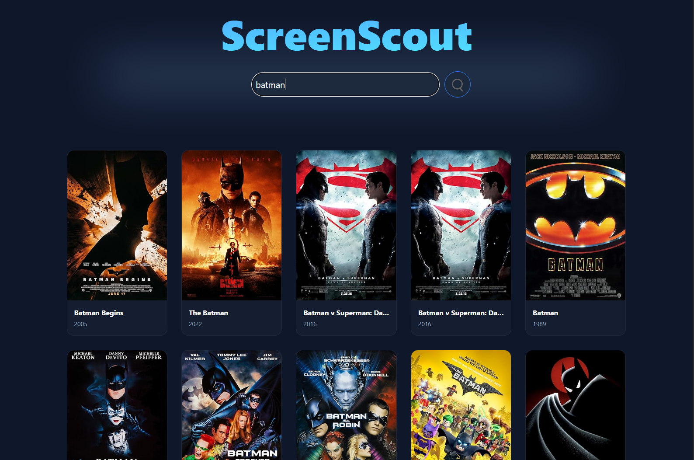
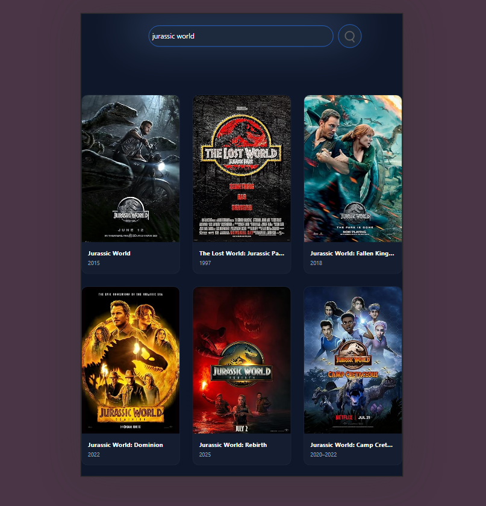
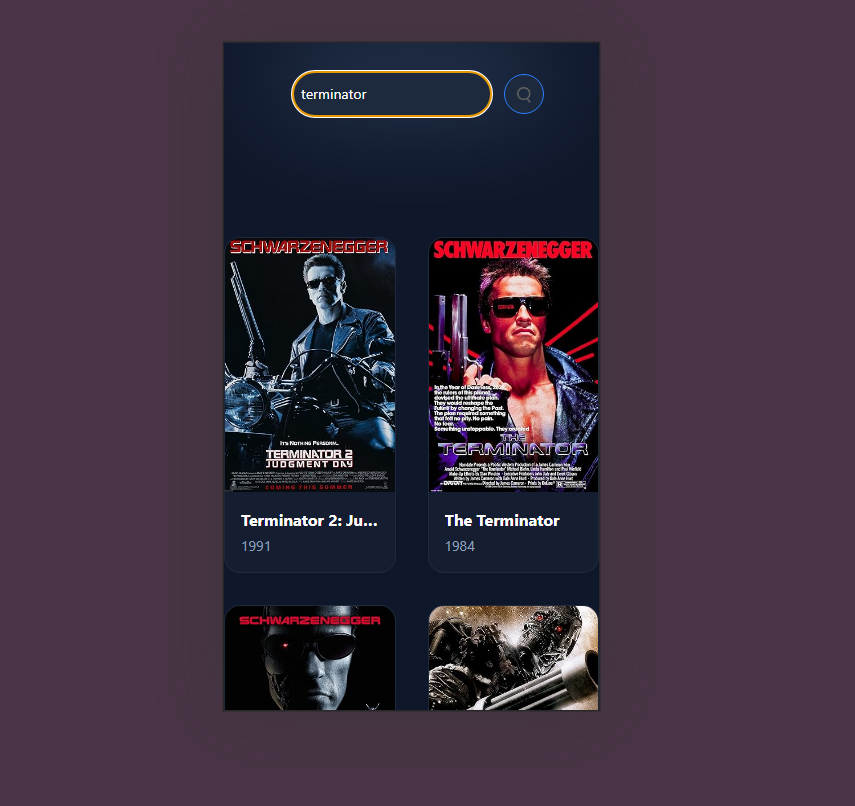

# 🎬 ScreenScout - Movie Discovery Engine

ScreenScout is a sleek, cinematic web application that allows users to search through thousands of movies and TV shows in real-time. Built with a "Design-First" approach, it features a modern dark-mode interface with glassmorphism effects and responsive grid layouts.

## ✨ Features

- **Real-time Search:** Instantly fetch movie data from the OMDb API.
- **Cinematic UI:** Dark-themed interface with blue ambient glows and smooth hover transitions.
- **Responsive Design:** Fully optimized for Mobile, Tablet, and Desktop using CSS Grid.
- **Glassmorphism:** Modern search bar design with backdrop blurs and subtle borders.
- **Smart Placeholders:** Automatically handles missing movie posters with elegant placeholders.

## 🛠️ Tech Stack

- **HTML5:** Semantic structure.
- **Tailwind CSS v4:** Modern utility-first styling.
- **JavaScript (ES6+):** Asynchronous API handling (Fetch/Await).
- **OMDb API:** The data engine.

## 🚀 Getting Started

1. **Clone the repository:**
   ```bash
   git clone [https://github.com/ashaaan/cinenova.git](https://github.com/Ashaaan/Movie_engine)
   ```

## App screenshots

- **Desktop**
  
- **Tablets**
  
- **Mobile phones**
  
